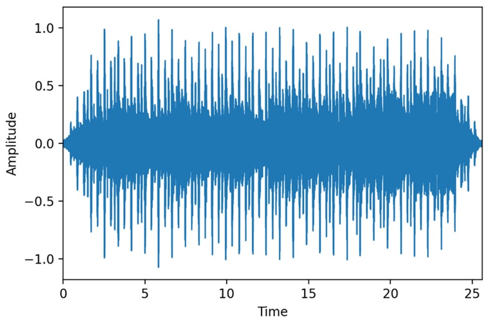
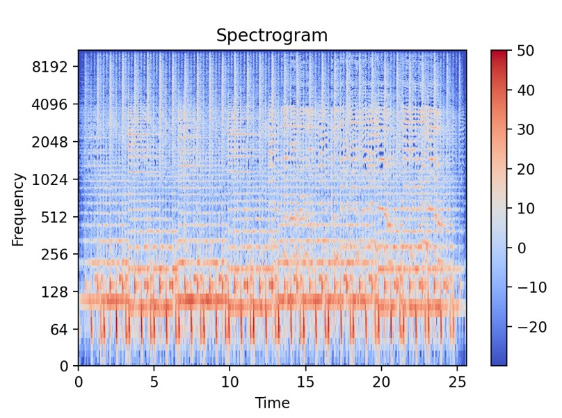
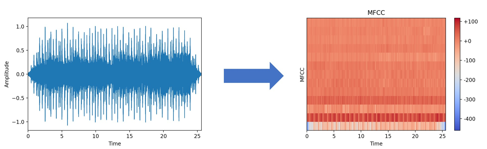
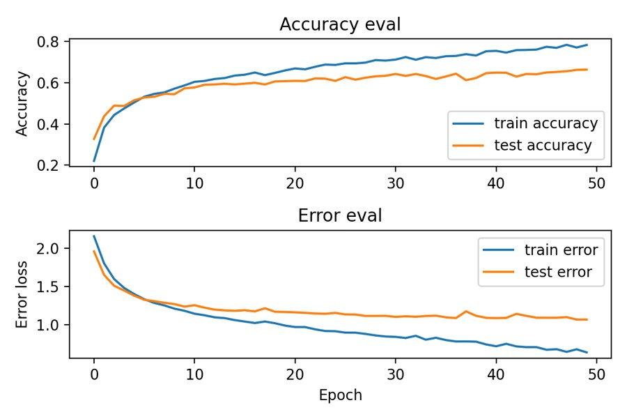

# Music Processing

This repository contains work related to audio processing and music genre classifier. The documentation for each of the following sections can be found within the corresponding notebooks.

- [X] Input Data Visualization
- [X] MFCC Extraction
- [X] Genre Classifier using GTZAN dataset
- [ ] Extracting & testing songs from Spotify

---

## 1. Input Data Visualization

[Notebook]()

Some basic analysis of an audio file like waveform plotting, spectrum display were performed in order to understand about audio data type

* Waveform plotting
* Power Spectral Density (PSD) plot
* Spectrogram
* Mel Spectrogram
* MFCC

## 2. MFCC Extraction

[Notebook]()

Utility to read all the .wav files stored in separate folders according to their genre, extract MFCC, and store these values in json format.

## 3. Genre Classifier using GTZAN Dataset

[Notebook]()

* Neural Network
* Improved Neural Network
* Convolutional Neural Network (CNN)
* RNN - LSTM
